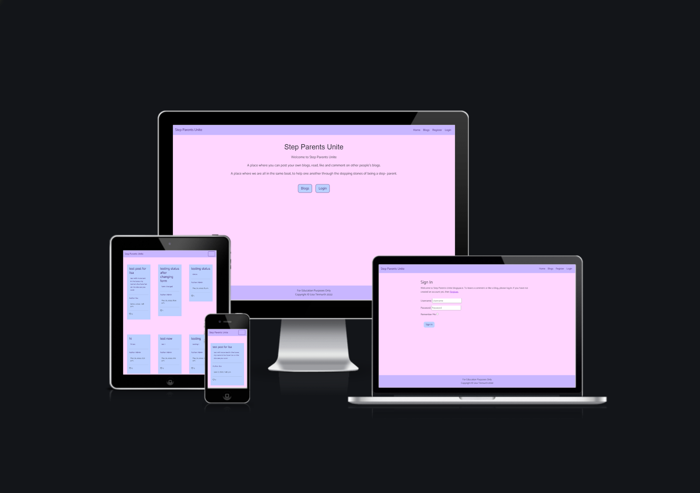

# Step Parents Unite

[view the live site here](https://step-parents-unite.herokuapp.com/)

[View the GitHub repository here](https://github.com/Mrst12/step-parents-unite)

## Introduction
Step Parents Unite is a blog website designed for step families to chat and support
each other with the ups and downs of either just step children or blended families.
Being a parent to your own biological children can be tough, but the maze of being a step parent is much
more difficult so I was hoping this page could bridge this gap.

*We all need moral support*

## Contents 
- [User Experience](#user-experience)
    - [Admin](#admin)
    - [General User](#general-user)
    - [Member User](#member-user)
- [Design](#design)
    - [Wireframes](#wireframes)
    - [Flowcharts](#flowcharts)
    - [Database models](#database-models)
    - [Colour Scheme](#colour-scheme)
    - [Typography](#typography)
- [Features](#features)
    - [Existing Features](#existing-features)
    - [Future Features](#future-features)
- [Technologies used](#technologies-used)
    - [Frameworks, Libraries & Tools Used](#frameworks-libraries--tools-used)
- [Testing](#testing)
- [Bugs](#bugs)
- [Deployment](#deployment)
- [Credits](#credits)
    - [Acknowledgements](#acknowledgements)

## User Experience

### Admin

- As Site Admin, I can approve/disapprove blogs and comments so that I can filter out objectionable Content.
- As Site Admin I can create, post, edit or delete blogs so that I can share and manage my blogs.
- As Site Admin I can have all the functionality of a member user so that I can be involved with the blog site.

### General User

- As a general user, I can view a list of blogs so that I can select one to read.
- As a general user, I can click on a blog so that I can read the whole blog.
- As a general user, I can view the number of likes on a blog, so that I can see which is most popular.
- As a general user, I can view comments on individual blogs so I can read the full conversation.
- As a general user, I can register for an account to take full member user benefits.

### Member user

- As a member user, I can create, post, edit or delete blogs so that I can share and manage my blogs.
- As a member user, I can like/unlike blogs so that I can interact with the content.
- As a member user, I can leave comments on a blog, so that I can be involved with the conversation.

## Design

### Wireframes
[wireframes for project](./assets/wireframes/step-parents-unite.pdf)

### Flowcharts
[Admin flowcharts for project](./assets/wireframes/admin-chart.pdf)

[User flowcharts for project](./assets/wireframes/user-flowchart.pdf)

### Database Models

[Table for post model database](./assets/wireframes/post-model.pdf)

[Table for comment model database](./assets/wireframes/comments-model.pdf)

### Colour Scheme

### Typography

## Features

### Existing Features

### Future Features

## Technologies used

### Frameworks, Libraries & Tools Used
- Balsamiq
    - For the wireframes
- Lucid app
    - For the flowchart
- Word
    - For the Database models
- Git 
    - For version control, committing and pushing to GitHub
- GitHub
    - For storing the repository, files and images pushed from Gitpod
- Gitpod
    - IDE used to code my project
- Heroku
    - Used to deploy the application

## Testing

## Bugs

## Deployment

## Credits

### Acknowledgements