# Step Parents Unite

[view the live site here](https://step-parents-unite.onrender.com)

## Introduction
Step Parents Unite is a blog website designed for step families to chat and support
each other with the ups and downs of either just step children or blended families.
Being a parent to your own biological children can be tough, but the maze of being a step parent is much
more difficult so I was hoping this page could bridge this gap.

*We all need moral support*

## Contents 
- [User Experience](#user-experience)
    - [Admin](#admin)
    - [General User](#general-user)
    - [Member User](#member-user)
- [Design](#design)
    - [Wireframes](#wireframes)
    - [Flowcharts](#flowcharts)
    - [Database models](#database-models)
    - [Colour Scheme](#colour-scheme)
    - [Typography](#typography)
- [Features](#features)
    - [Existing Features](#existing-features)
    - [Future Features](#future-features)
- [Technologies used](#technologies-used)
    - [Frameworks, Libraries & Tools Used](#frameworks-libraries--tools-used)
    - [Resources](#resources)
- [Testing](#testing)
- [ Fixed Bugs](#fixed-bugs)
- [Known Bugs](#known-bugs)
- [Deployment](#deployment)
- [Credits](#credits)
    - [Acknowledgements](#acknowledgements)

## User Experience
- I designed the site with the design thinking approach, with only neccessary content/information.
- Users can look around the site easily without being bombarded with lots of clutter.
- My User stories can be found [here](https://github.com/Mrst12/step-parents-unite/projects/2)

### Admin

- As Site Admin, I can approve/disapprove blogs and comments so that I can filter out objectionable Content.
- As Site Admin I can create, post, edit or delete blogs so that I can share and manage my blogs.
- As Site Admin I can have all the functionality of a member user so that I can be involved with the blog site.

### General User

- As a general user, I can view a list of blogs so that I can select one to read.
- As a general user, I can click on a blog so that I can read the whole blog.
- As a general user, I can view the number of likes on a blog, so that I can see which is most popular.
- As a general user, I can view comments on individual blogs so I can read the full conversation.
- As a general user, I can register for an account to take full member user benefits.

### Member user

- As a member user, I can create, post, edit or delete blogs so that I can share and manage my blogs.
- As a member user, I can like/unlike blogs so that I can interact with the content.
- As a member user, I can leave comments on a blog, so that I can be involved with the conversation.

## Design
- I have used an agile approach to the project my development board for the project can be viewed 
[here](https://github.com/Mrst12/step-parents-unite/projects/1)

### Wireframes
[wireframes for project](./assets/wireframes/step-parents-unite.pdf)

### Flowcharts
[Admin flowcharts for project](./assets/wireframes/admin-chart.pdf)

[User flowcharts for project](./assets/wireframes/user-flowchart.pdf)

### Database Models

[Table for post model database](./assets/wireframes/post-model.pdf)

[Table for comment model database](./assets/wireframes/comments-model.pdf)

### Colour Scheme
I used a range of colours that complimented each other, and a darker colour for the text so it 
was better for accessibility.

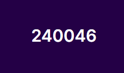

### Typography

- I used Monserrat for the main title, and Catamaran for the rest of the text.

## Features

- Registered users will have full CRUD functionality, They can **C**reate, **R**ead, **U**pdate, and **D**elete blogs.

### Existing Features
- **Home Page**
    - The Home page has minimal content so it is not overcrowded for the user. The page has a navigation bar,
    with the logo that will take you back to the home page, a blog button, to take any user to the blogs page,
    When a user is not logged in there is a register button, and a Login button. On the tablet and mobile sizes the navigation bar collapses to a burger menu. There is a footer across the bottom of every page to indicate the end of the page.

    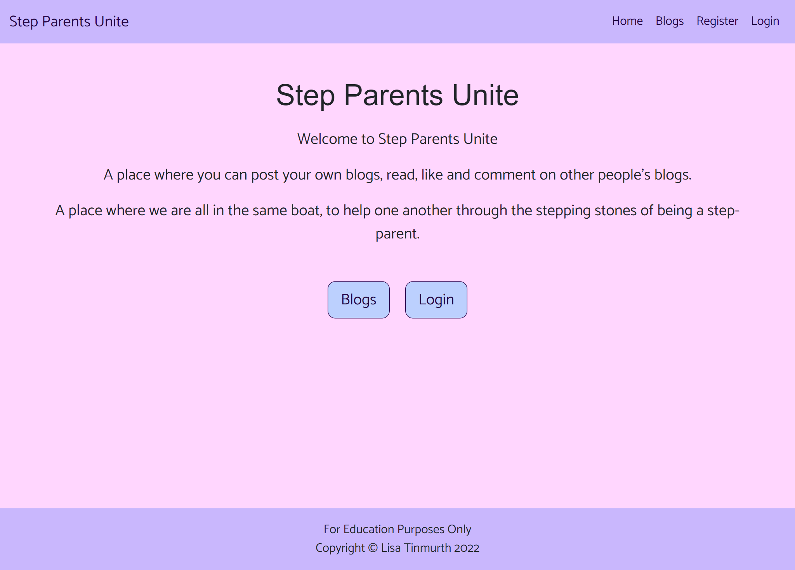
    
    - When a user is logged in the reister button on the navigation bar is changed to an Acoount button, which takes them to manage their blog page, the Login button becomes a Logout button, so the user knows their status.

    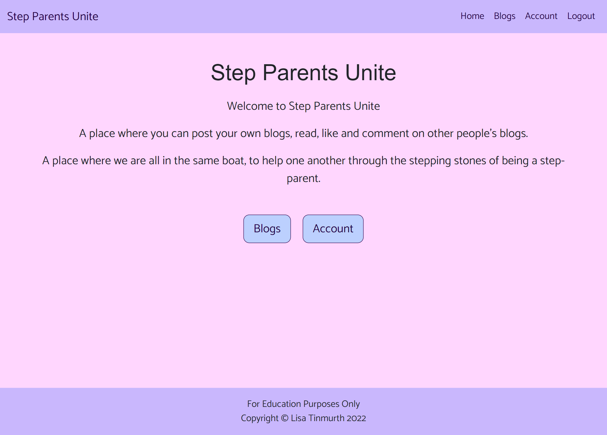

- **Blog Page**
    - Any user can enter the blog page, It is a showcase of all blogs.
    - The Title, excerpt, author, date and time created on and the number of likes is visible on each blog.

    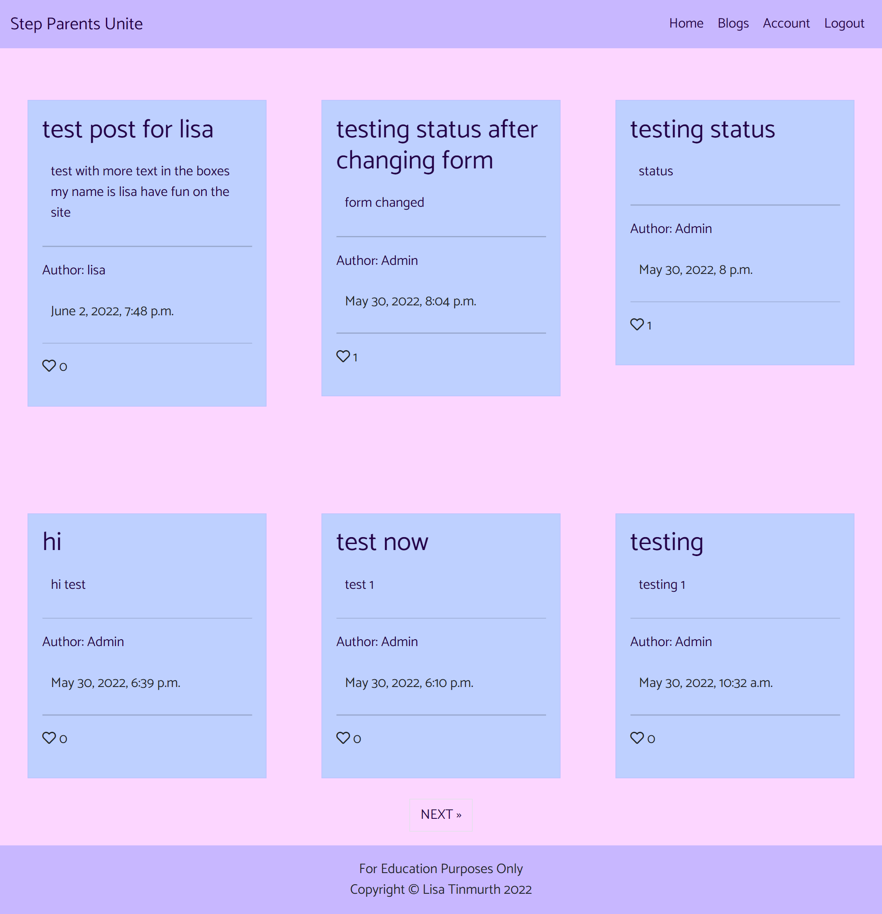

- **Blog-details Page**
    - This page is accessible to any user.
    - When the user is not logged in the can view the title, author, content of blog, time and date created, the number of likes and comments, and the comments made by others.

    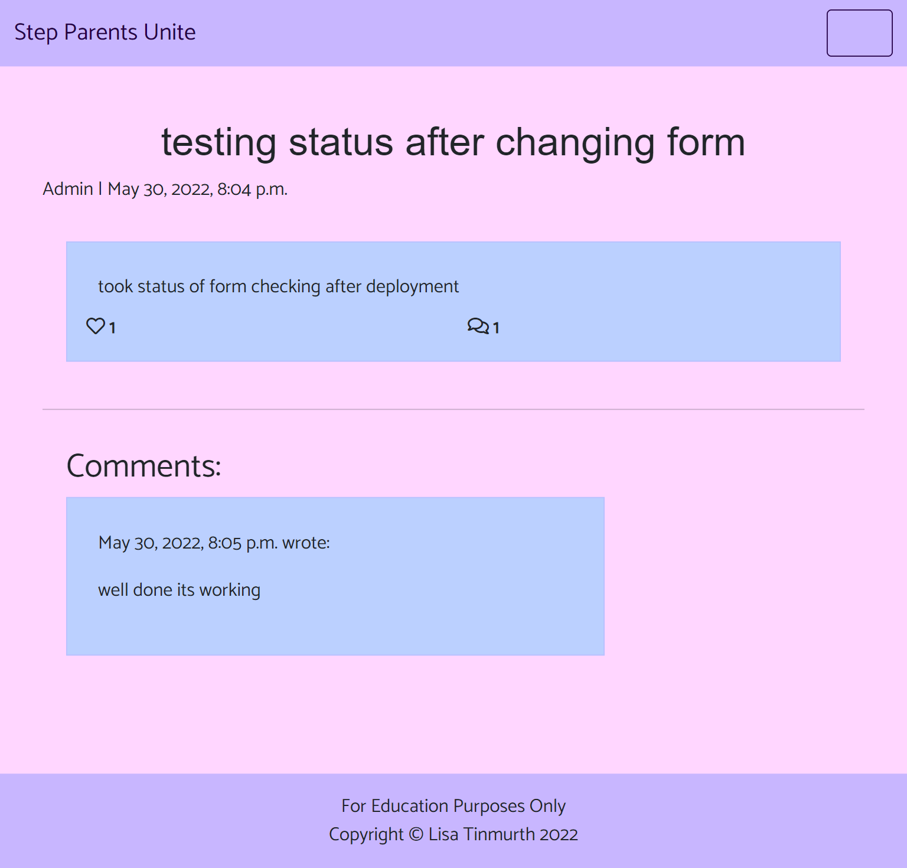

    - when the user is logged in they can view the same as other users but they have the ability to like a post, and to comment on the post.

    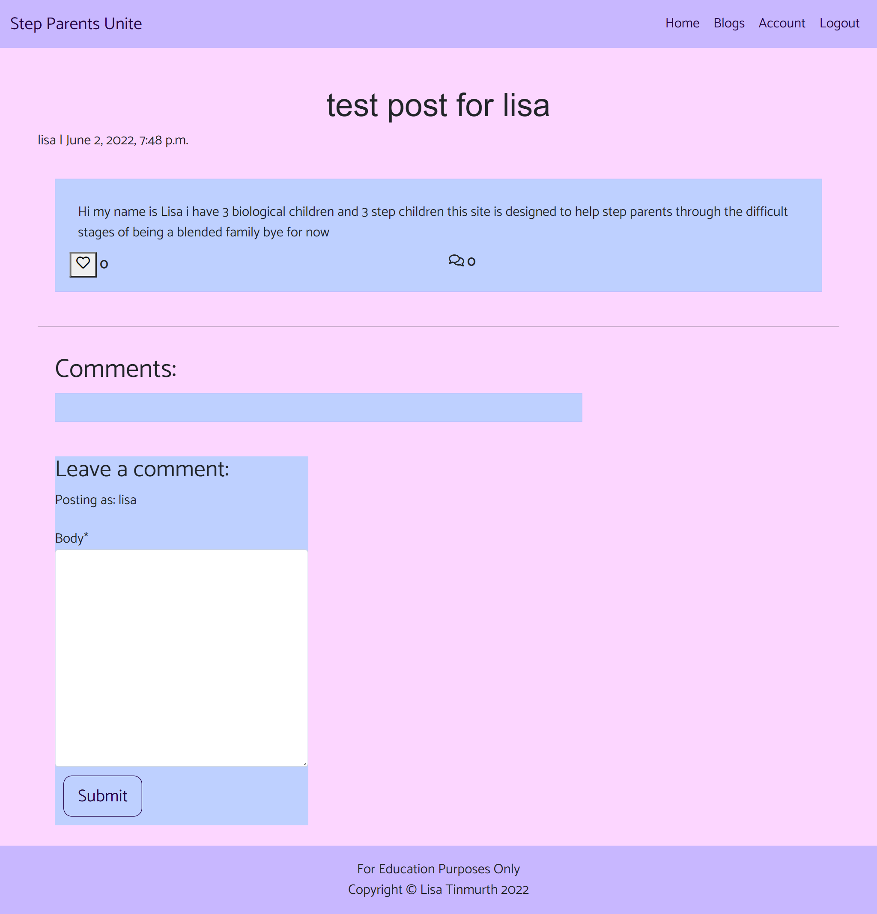

- **Register page**
    - Users can register for their own account.
    - A registered user has access to more features such as liking and commenting on existing posts as well as publishing  and managing (edit/delete)their own blogs.

    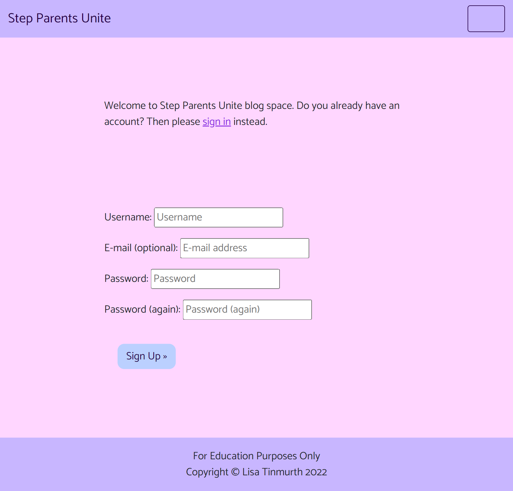

- **Logout**
    - When a user clicks the logout button form the menu or accounts page it triggers a logout modal.
    - The logout modal is used for confirmation the user wants to logout out.

    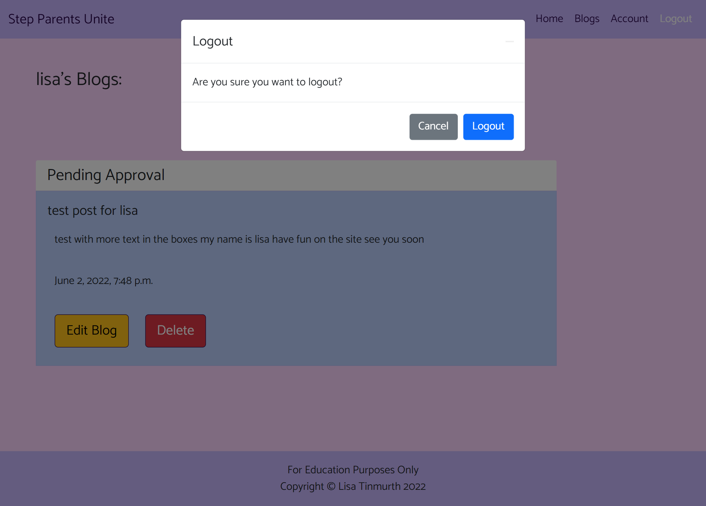

- **User Account/ Profile Page**
    - Once the user is registered and logged in they have a user profile page.
    - On the profile page they can Publish a blog, manage their blogs, or logout.

    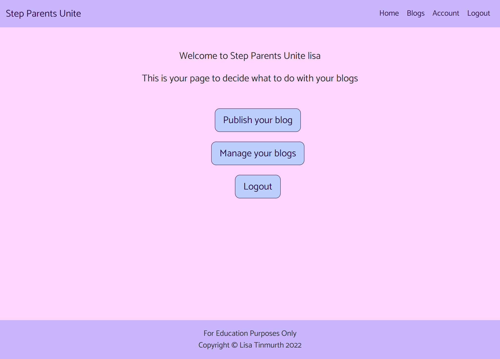

- **Publish page**
    - This page is where the user can publish their own page.
    - Once approved the published blog will appear in the blog page.

    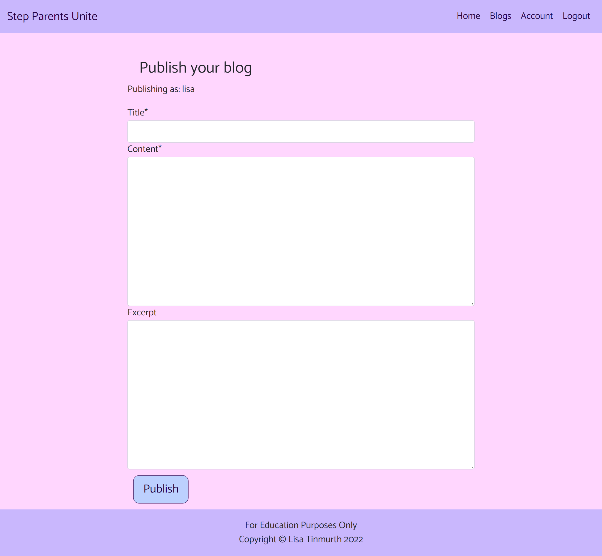

- **Manage blog page**
    - This page shows the user all of their blogs
    - It displays the status of their blog either awaiting approval or published
    
    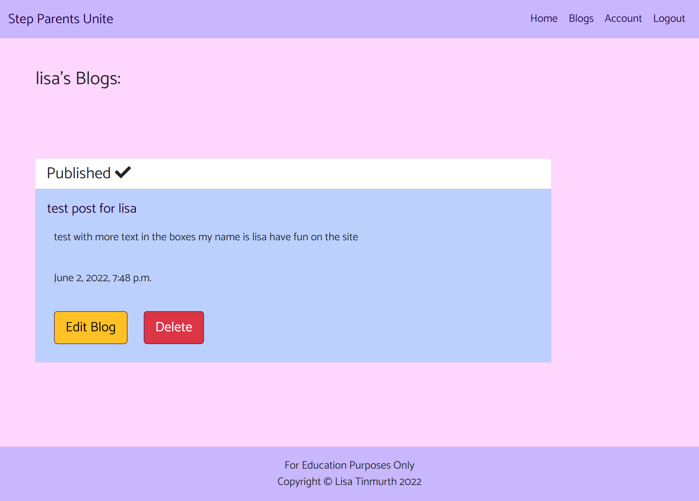

    - The user can edit their blogs from this page.
    - The form is already pre populated to make it easier for the user.

    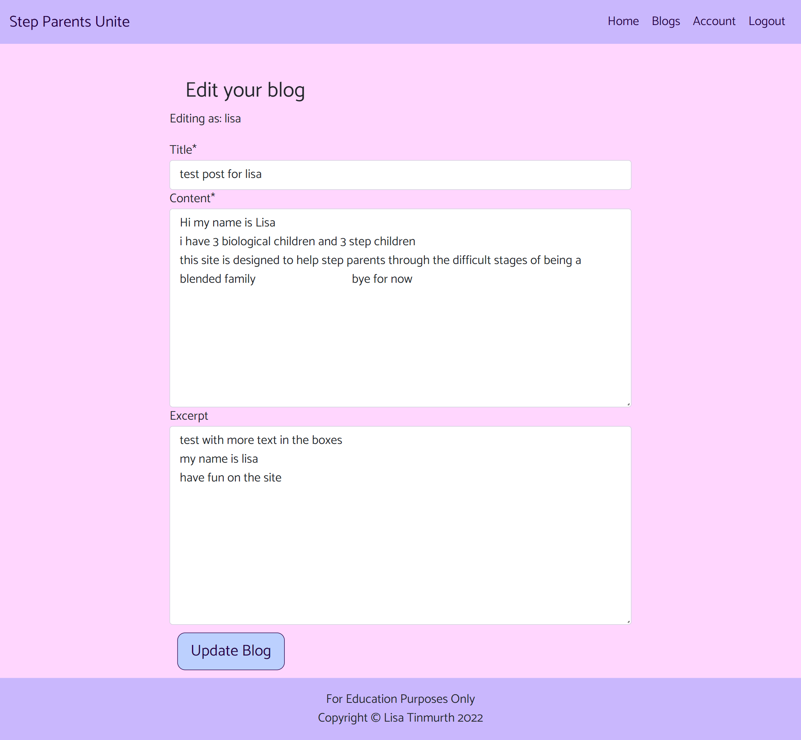

    - The user can also delete blogs from this page.
    - The delete button will trigger a modal used as confirmation they do want to delete the blog.

    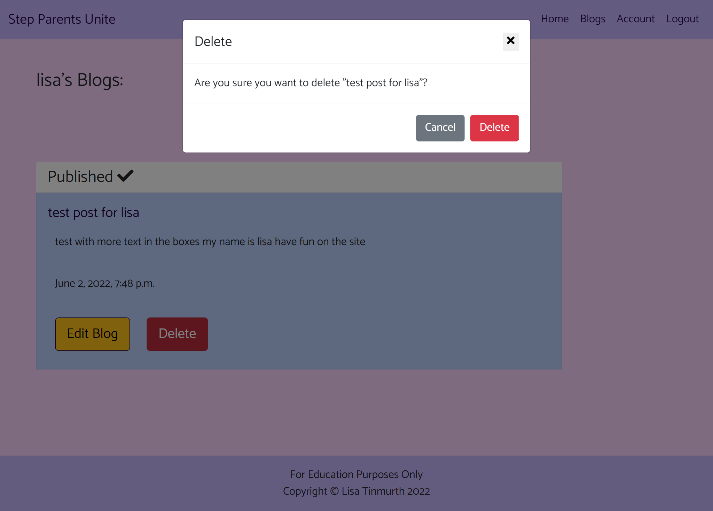

- **Comments**
- Throughout the site there is comments that is displayed so a user knows things have happened like logging out, or form submitted to admin.

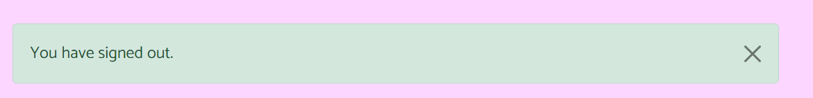

### Future Features
- The ability to sign in with social accounts like Facebook, Google etc.
- Members can save blogs they like for easy access in the future.
- The ability to tag other members in posts.
- The ability to follow other users.
- Include a forgotten password function to change or reset password.
- Create a search bar to search for blogs containing a specific word or phrase.

## Technologies used
- HTML
- CSS
- JavaScript
- Python
    - The below modules were used for the development of the project.
        *   asgiref==3.5.1
        *   cloudinary==1.29.0
        *   dj-database-url==0.5.0
        *   dj3-cloudinary-storage==0.0.6
        *   Django==3.2.13
        *   django-allauth==0.50.0
        *   django-crispy-forms==1.14.0
        *   django-summernote==0.8.20.0
        *   gunicorn==20.1.0
        *   oauthlib==3.2.0
        *   psycopg2==2.9.3
        *   PyJWT==2.4.0
        *   python3-openid==3.2.0
        *   pytz==2022.1
        *   requests-oauthlib==1.3.1
        *   sqlparse==0.4.2

### Frameworks, Libraries & Tools Used
- Balsamiq
    - For the wireframes
- Lucid app
    - For the flowchart
- Word
    - For the Database models
- Git 
    - For version control, committing and pushing to GitHub
- GitHub
    - For storing the repository, files and images pushed from Gitpod
- Gitpod
    - IDE used to code my project
- Heroku
    - Used to deploy the application
- Bootstrap
    - Used for grids, layout, columns, cards and forms structure
- Django
    - Used for django frameworks to manage the apps
- Google Fonts
    - Used for the fonts on the site
- Fontawesome
    - Used for the additional icons
- Coolors
    - Used for the colour scheme on the site
- PostgreSQL
    - Used for the database storage of the models
- Cloudinary
    - Used for image and static files
- AmIResponsive
    - used for the responsiveness of the site
- Lighthouse
    - Used for testing site functionality
- W3C Markup Validation Service
    - Used for HTML testing
- W3C CSS Validation Service
    - Used for CSS testing
- PEP8
    - Used for Python testing files

### Resources
- Code institute's Codestar Django Blog walktrough project, was used for the beginning development of my project,as it was the first time using the Django framework, It was very helpful for the initial setup.
- I used the **Django documentation** to make sure I was heading in the right direction, and it helped with the configuration of my email settings on my registartion form.
- Google for sorting out problems or to check my understanding.
- stack overflow to fix reported bug
- Code Institute's slack community for bugfixing and moral support.
- Chrome Developer Tools for tweaking styling to make sure they were right.
    
## Testing
- *Unit testing*, *Validator testing* and *User story testing* can all be found [here](/TESTING.md)
## Fixed Bugs
- The bugs can be seen documented in my kanban development board in their own column [here](https://github.com/Mrst12/step-parents-unite/projects/1)

- Heroku initial deployment
    - I had an issue where I couldnt do a deployment to Heroku, it was not recognising the projects name.
        - It was fixed by changing the filename in the Procfile from what I had put step-parents-unite to what it should of been step_parents_unite. It was then deployed to Heroku.
- Submit not redirecting
    - When a user wanted to comment on a blog they fill in the body and then click submit, this was redirecting to a page saying "This page is not working, contact the owner, error 405"
        - To fix it I did a google search on error 405, which gave me an idea the problem was in my views.py file,
        I had an indented block of code, the clue came from the problems tab on the terminal, sorted the indentation and the submit worked as it should.
- White gap on footer
    - My footer was not stretching across the whole page I had a white gap on the left hand side.
        - Used developer tools to investigate the problem and found I had added a margin to the body which was causing the issue, restyled and it looked as it should.
- Only one post on my blog page
    - On my manage blog page it was only ever showing the last post that was put there.
        Went through the blog file line by line to see if I could establish the problem, and found I had missed off a closing div element, added it in and the problem was resolved.
- Trailing whitespace
    - When doing the PEP8 testing on my views.py file I found [this error](./assets/documentation/pep8-views.py-bug.png)
        - Did a google search for the problem and came up with [this article](stackoverflow.com/questions/21410075/what-is-trailing-whitespace-and-how-can-i-handle-this) implemented the changes and the error was gone.

## Known bugs
- Page layout
    - On tablet devices I originally wanted 2 cards per row however I was getting
     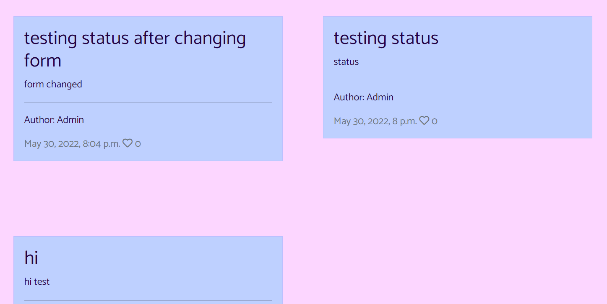
    - It was the same layout all down the page, the pagination was set to six, I spent a good few days trying to research and resolve this issue, on google, stackoverflow, slack all to no avail. I decided to leave the tablet view at 3 per page as it didnt look as squashed as I thought it would when designing the wireframes.
    - Something to revisit in the future when my scope is a bit wider.
    
## Deployment

- Initial deployment was made early on in the process of making this project to avoid any unforseen errors when deploying and causing stress if time was limited.

### Deployment through Heroku
1. Sign up / Log in to Heroku

2. From the main Heroku Dashboard page select 'New' and then 'Create New App'

3. Give the project a name and select a suitable region, then select create app. The name for the app must be unique. This will create the app within Heroku and bring you to the deploy tab. From the submenu at the top, navigate to the resources tab.

4. Add the database to the app, in the add-ons section search for 'Heroku Postgres', select the package that appears and add 'Heroku Postgres' as the database

5. Navigate to the setting tab, within the config vars section copy the DATABASE_URL to the clipboard for use in the Django configuration.

6. Within the django app repository create a new file called env.py - within this file import the os library and set the environment variable for the DATABASE_URL pasting in the address copied from Heroku. The line should appear as os.environ["DATABASE_URL"]= "Paste the link in here"

7. Add a secret key to the app using os.environ["SECRET_KEY"] = "your secret key goes here"
Add the secret key just created to the Heroku Config Vars as SECRET_KEY for the KEY value and the secret key value you created as the VALUE

8. In the settings.py file within the django app, import Path from pathlib, import os and import dj_database_url
insert the line if os.path.isfile("env.py"): import env
remove the insecure secret key that django has in the settings file by default and replace it with SECRET_KEY = os.environ.get('SECRET_KEY')
replace the databases section with DATABASES = { 'default': dj_database_url.parse(os.environ.get("DATABASE_URL"))} ensure the correct indentation for python is used.

9. In the terminal migrate the models over to the new database connection
Navigate in a browser to cloudinary, log in, or create an account and log in.

10. From the dashboard - copy the CLOUDINARY_URL to the clipboard
in the env.py file created earlier - add os.environ["CLOUDINARY_URL"] = "paste in the Url copied to the clipboard here"

11. In Heroku, add the CLOUDINARY_URL and value copied to the clipboard to the config vars
Also add the KEY - DISABLE_COLLECTSTATIC with the Value - 1 to the config vars
this key value pair must be removed prior to final deployment

12. Add the cloudinary libraries to the list of installed apps, the order they are inserted is important, 'cloudinary_storage' goes above 'django.contrib.staticfiles' and 'cloudinary' goes below it.

13. In the Settings.py file - add the STATIC files settings - the url, storage path, directory path, root path, media url and default file storage path.
Link the file to the templates directory in Heroku TEMPLATES_DIR = os.path.join(BASE_DIR, 'templates')

14. Change the templates directory to TEMPLATES_DIR - 'DIRS': [TEMPLATES_DIR]

15. Add Heroku to the ALLOWED_HOSTS list the format will be the app name given in Heroku when creating the app followed by .herokuapp.com

16. In your code editor, create three new top level folders, media, static, templates

17. Create a new file on the top level directory - Procfile

18. Within the Procfile add the code - web: guincorn PROJECT_NAME.wsgi

19. In the terminal, add the changed files, commit and push to GitHub

20. In Heroku, navigate to the deployment tab and deploy the branch manually - watch the build logs for any errors.

Heroku will now build the app for you. Once it has completed the build process you will see a 'Your App Was Successfully Deployed' message and a link to the app to visit the live site.

### Forking the Gihub Repository

1. By forking the GitHub Repository, you will be able to make a copy of the original repository on your own GitHub account, allowing you to view and/or make changes without affecting the original repository by using the following steps:

2. Log in to GitHub and locate the GitHub Repository At the top of the Repository (not top of page), just above the "Settings" button on the menu, locate the "Fork" button. You should now have a copy of the original repository in your GitHub account.

### Making a Local Clone

1. Log in to GitHub and locate the GitHub Repository Under the repository name.

2. Click "Clone or download". 

3. To clone the repository using HTTPS, under "Clone with HTTPS", copy the link. 

4. Open Git Bash.  

5. Change the current working directory to the location where you want the cloned directory to be made. 

6. Type git clone, and then paste the URL you copied in Step 3.

## Credits
- Code institute's Django blog walkthrough, was my initial confidence booster as that was the first time I had encountered the Django framework, so the walkthrough was used to help guide me through the initial setup.
- Django3 by example was a book suggested to me which was helpful to show me how things should be laid out and setup.
- [Django-allauth](https://django-allauth.readthedocs.io/en/latest/configuration.html) configuration of the email in the registration form.

### Acknowledgements
- Code institute for course material and content.
- Everybody on the slack community for their help and moral support.
- My mentor for advise and assistance on planning and submission feedback.
- My husband and children for their patience, support and understanding.