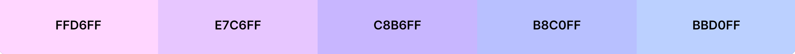

# Step Parents Unite

[view the live site here](https://step-parents-unite.herokuapp.com/)

[View the GitHub repository here](https://github.com/Mrst12/step-parents-unite)

## Introduction
Step Parents Unite is a blog website designed for step families to chat and support
each other with the ups and downs of either just step children or blended families.
Being a parent to your own biological children can be tough, but the maze of being a step parent is much
more difficult so I was hoping this page could bridge this gap.

*We all need moral support*

## Contents 
- [User Experience](#user-experience)
    - [Admin](#admin)
    - [General User](#general-user)
    - [Member User](#member-user)
- [Design](#design)
    - [Wireframes](#wireframes)
    - [Flowcharts](#flowcharts)
    - [Database models](#database-models)
    - [Colour Scheme](#colour-scheme)
    - [Typography](#typography)
- [Features](#features)
    - [Existing Features](#existing-features)
    - [Future Features](#future-features)
- [Technologies used](#technologies-used)
    - [Frameworks, Libraries & Tools Used](#frameworks-libraries--tools-used)
- [Testing](#testing)
- [Bugs](#bugs)
- [Deployment](#deployment)
- [Credits](#credits)
    - [Acknowledgements](#acknowledgements)

## User Experience
- I designed the site with the design thinking approach, with only neccessary content/information.
- Users can look around the site easily without being bombarded with lots of clutter.
- My User stories can be found [here](https://github.com/Mrst12/step-parents-unite/projects/2)

### Admin

- As Site Admin, I can approve/disapprove blogs and comments so that I can filter out objectionable Content.
- As Site Admin I can create, post, edit or delete blogs so that I can share and manage my blogs.
- As Site Admin I can have all the functionality of a member user so that I can be involved with the blog site.

### General User

- As a general user, I can view a list of blogs so that I can select one to read.
- As a general user, I can click on a blog so that I can read the whole blog.
- As a general user, I can view the number of likes on a blog, so that I can see which is most popular.
- As a general user, I can view comments on individual blogs so I can read the full conversation.
- As a general user, I can register for an account to take full member user benefits.

### Member user

- As a member user, I can create, post, edit or delete blogs so that I can share and manage my blogs.
- As a member user, I can like/unlike blogs so that I can interact with the content.
- As a member user, I can leave comments on a blog, so that I can be involved with the conversation.

## Design
- I have used an agile approach to the project my development board for the project can be viewed 
[here](https://github.com/Mrst12/step-parents-unite/projects/1)

### Wireframes
[wireframes for project](./assets/wireframes/step-parents-unite.pdf)

### Flowcharts
[Admin flowcharts for project](./assets/wireframes/admin-chart.pdf)

[User flowcharts for project](./assets/wireframes/user-flowchart.pdf)

### Database Models

[Table for post model database](./assets/wireframes/post-model.pdf)

[Table for comment model database](./assets/wireframes/comments-model.pdf)

### Colour Scheme
I used a range of colours that complimented each other, and a darker colour for the text so it 
was better for accessibility.

### Typography

- I used Monserrat for the main title, and Catamaran for the rest of the text.

## Features

- Registered users will have full CRUD functionality, They can **C**reate, **R**ead, **U**pdate, and **D**elete blogs.

### Existing Features
- **Home Page**
    - The Home page has minimal content so it is not overcrowded for the user. The page has a navigation bar,
    with the logo that will take you back to the home page, a blog button, to take any user to the blogs page,
    When a user is not logged in there is a register button, and a Login button. On the tablet and mobile sizes the navigation bar collapses to a burger menu. There is a footer across the bottom of every page to indicate the end of the page.

    
    
    - When a user is logged in the reister button on the navigation bar is changed to an Acoount button, which takes them to manage their blog page, the Login button becomes a Logout button, so the user knows their status.

    

- **Blog Page**
    - Any user can enter the blog page, It is a showcase of all blogs.
    - The Title, excerpt, author, date and time created on and the number of likes is visible on each blog.

    

- **Blog-details Page**
    - This page is accessible to any user.
    - When the user is not logged in the can view the title, author, content of blog, time and date created, the number of likes and comments, and the comments made by others.

    

    - when the user is logged in they can view the same as other users but they have the ability to like a post, and to comment on the post.

    

- **Register page**
    - Users can register for their own account.
    - A registered user has access to more features such as liking and commenting on existing posts as well as publishing  and managing (edit/delete)their own blogs.

    

- **Logout**
    - When a user clicks the logout button form the menu or accounts page it triggers a logout modal.
    - The logout modal is used for confirmation the user wants to logout out.

    

- **User Account/ Profile Page**
    - Once the user is registered and logged in they have a user profile page.
    - On the profile page they can Publish a blog, manage their blogs, or logout.

    

- **Publish page**
    - This page is where the user can publish their own page.
    - Once approved the published blog will appear in the blog page.

    

- **Manage blog page**
    - This page shows the user all of their blogs
    - It displays the status of their blog either awaiting approval or published
    
    

    - The user can edit their blogs from this page.
    - The form is already pre populated to make it easier for the user.

    

    - The user can also delete blogs from this page.
    - The delete button will trigger a modal used as confirmation they do want to delete the blog.

    

### Future Features
- The ability to sign in with social accounts like Facebook, Google etc.
- Members can save blogs they like for easy access in the future.
- The ability to tag other members in posts.
- The ability to follow other users.
- Include a forgotten password function to change or reset password.
- Create a search bar to search for blogs containing a specific word or phrase.

## Technologies used
- HTML
- CSS
- JavaScript
- Python
    - The below modules were used for the development of the project.
        *   asgiref==3.5.1
        *   cloudinary==1.29.0
        *   dj-database-url==0.5.0
        *   dj3-cloudinary-storage==0.0.6
        *   Django==3.2.13
        *   django-allauth==0.50.0
        *   django-crispy-forms==1.14.0
        *   django-summernote==0.8.20.0
        *   gunicorn==20.1.0
        *   oauthlib==3.2.0
        *   psycopg2==2.9.3
        *   PyJWT==2.4.0
        *   python3-openid==3.2.0
        *   pytz==2022.1
        *   requests-oauthlib==1.3.1
        *   sqlparse==0.4.2

### Frameworks, Libraries & Tools Used
- Balsamiq
    - For the wireframes
- Lucid app
    - For the flowchart
- Word
    - For the Database models
- Git 
    - For version control, committing and pushing to GitHub
- GitHub
    - For storing the repository, files and images pushed from Gitpod
- Gitpod
    - IDE used to code my project
- Heroku
    - Used to deploy the application
- Bootstrap
    - Used for grids, layout, columns, cards and forms structure
- Django
    - Used for django frameworks to manage the apps
- Google Fonts
    - Used for the fonts on the site
- Fontawesome
    - Used for the additional icons
- Coolors
    - Used for the colour scheme on the site
- PostgreSQL
    - Used for the database storage of the models
- Cloudinary
    - Used for image and static files
- AmIResponsive
    - used for the responsiveness of the site
- Lighthouse
    - Used for testing site functionality
- W3C Markup Validation Service
    - Used for HTML testing
- W3C CSS Validation Service
    - Used for CSS testing
- PEP8
    - Used for Python testing files
    
## Testing
- *Unit testing*, *Validator testing* and *User story testing* can all be found [here](/TESTING.md)
## Bugs

## Deployment

## Credits

### Acknowledgements