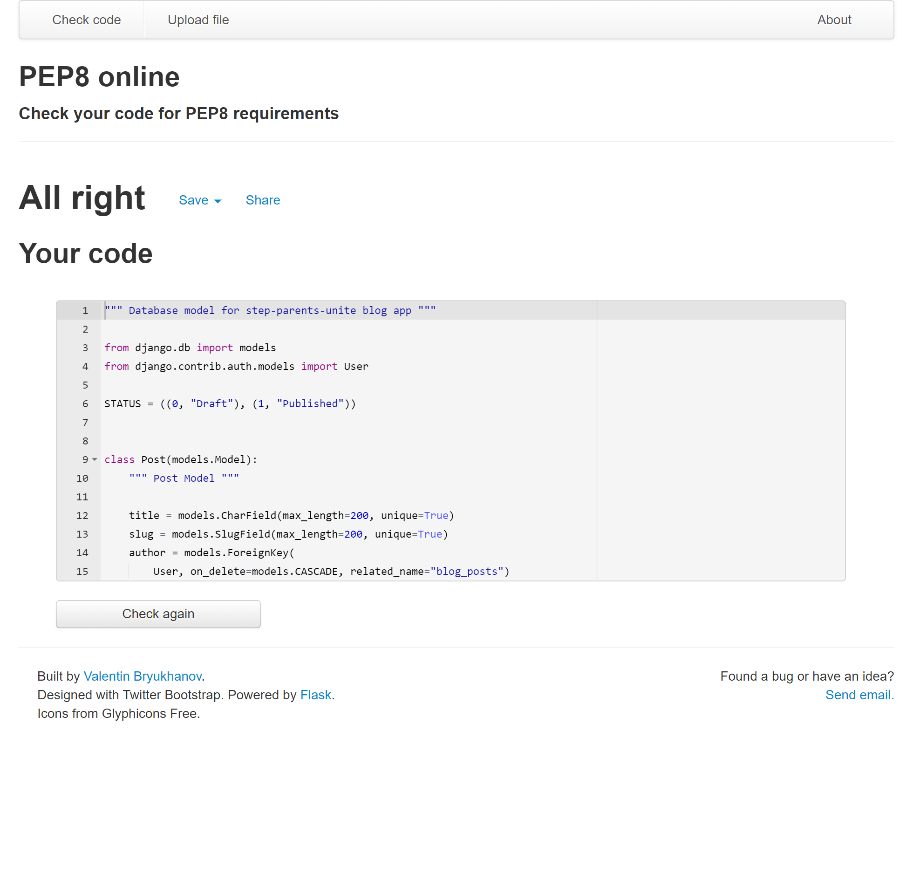
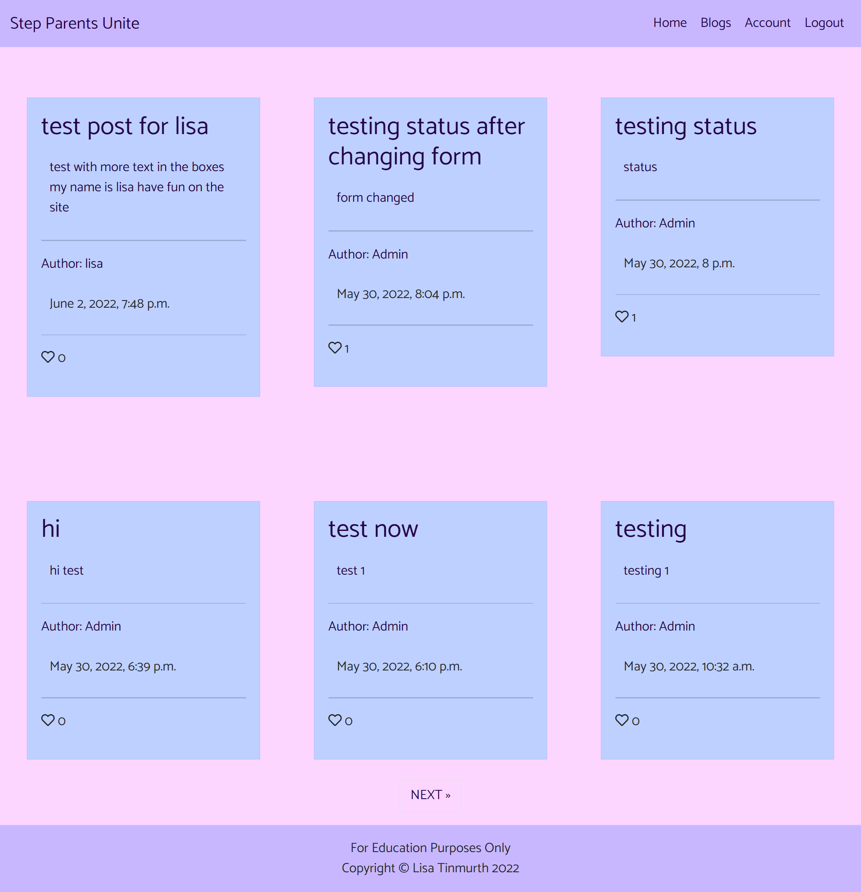
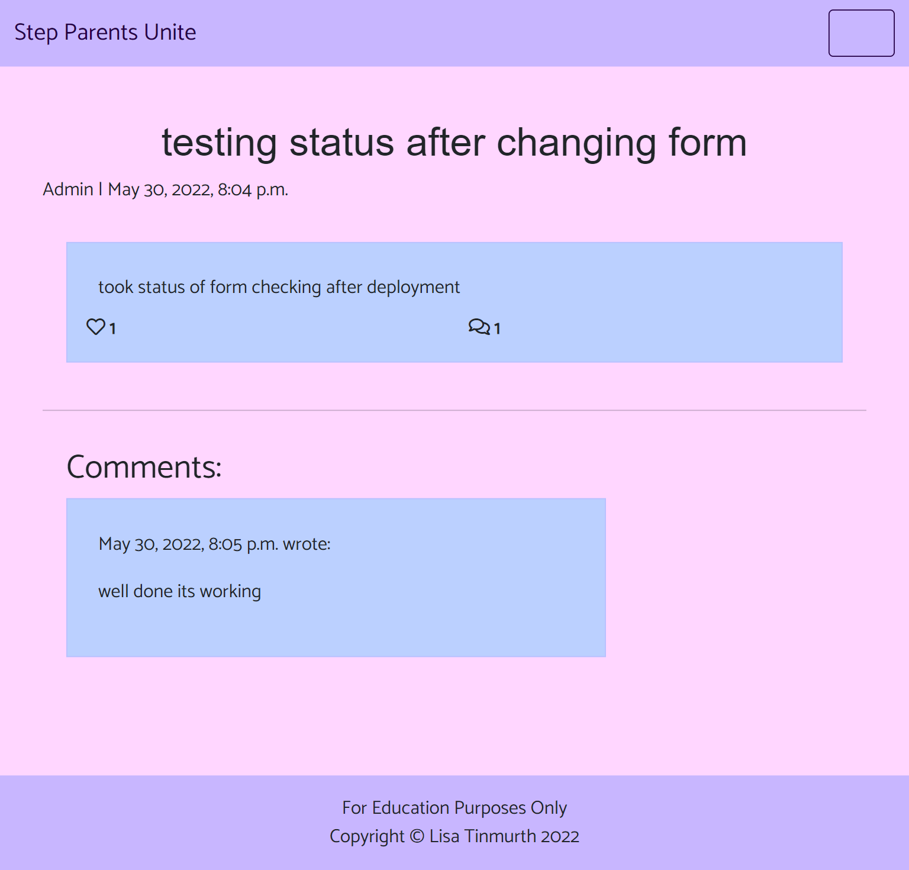
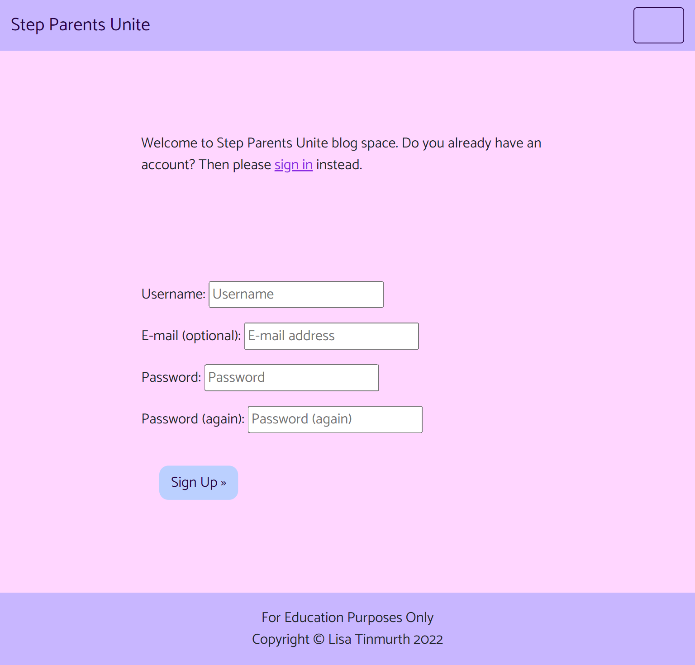
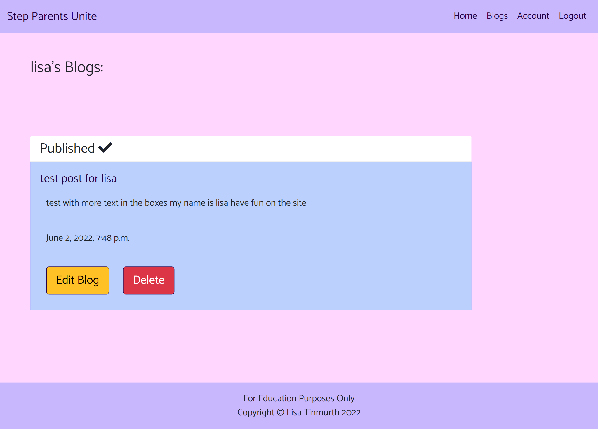

## Contents
- [Unit Testing](#unit-testing)
    - [Testing Views](#testing-views)
    - [Testing Forms](#testing-forms)
- [Validator Testing](#validator-testing)
    - [Lighthouse Test](#lighthouse-test)
    - [W3C Markup Validation](#w3c-markup-validation)
    - [W3C CSS Validation](#w3c-css-validation)
    - [PEP8 validation](#pep8-validaton)
- [User Story Testing](#user-story-testing)
    - [Admin](#admin)
    - [General User](#general-user)
    - [Member User](#member-user)
- [Final testing](#final-testing)

## Unit Testing

- I have used Django TestCase for automated testing for Views, and form files

### Testing Views
- Tested views to see if they are functioning as expected and returns the page the user needs to be at.
    
- Home page

- Blog page

- Profile Page

- Publishing Blogs Page

Result :

### Testing Forms
- Tested forms for comment form and blog form to make sure fields are expected and the form is submitted to where it should be.

- Testing blogform

- Testing Comment forms

Result:

## Validator Testing

### Lighthouse Test

- Lighthouse result for desktop

- Lighthose only gave a score of 92 for best practice, this was a problem beyond my scope at the moment

- Lighthouse result for mobile

### W3C Markup Validation

- Home page

- Blog page

- Blog detail page

- Register Page

- Login Page

- My Blogs Page

- Profile page

- Publish page

### W3C CSS Validation

- No errors or warnings found

### PEP8 validation
- There was only one error found in the views, documented it in the bugs section on the Readme document. It was resolved and then passed the tests.

- Unit testing for forms

- Unit testing for views

- blog app urls

- admin.py

- apps.py

- asgi.py

- forms.py

- models.py

- project url.py

- views.py bug

- views.py resolved

- wsgi.py

## User Story Testing

### Admin
- As Site Admin, I can approve/disapprove blogs and comments so that I can filter out objectionable Content.

- As Site Admin I can create, post, edit or delete blogs so that I can share and manage my blogs.
- As Site Admin I can have all the functionality of a member user so that I can be involved with the blog site.

### General User

- As a general user, I can view a list of blogs so that I can select one to read.

- As a general user, I can click on a blog so that I can read the whole blog.
- As a general user, I can view the number of likes on a blog, so that I can see which is most popular.
- As a general user, I can view comments on individual blogs so I can read the full conversation.

- As a general user, I can register for an account to take full member user benefits.

### Member User

- As a member user, I can create, post, edit or delete blogs so that I can share and manage my blogs.

- As a member user, I can like/unlike blogs so that I can interact with the content.
- As a member user, I can leave comments on a blog, so that I can be involved with the conversation.

## Final testing
- All pages have been tested on desktop, tablet, and mobile, links and buttons have been tested and appear satisfactory.